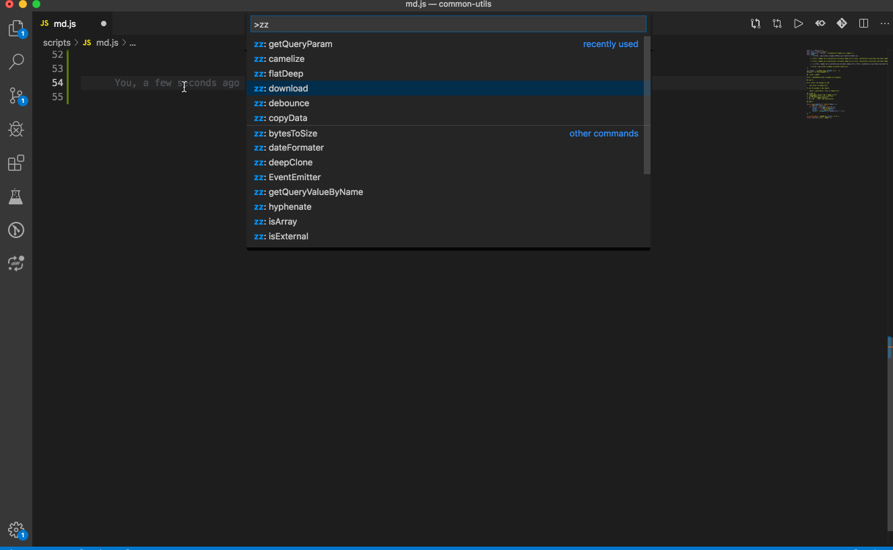

# common-utils [](https://marketplace.visualstudio.com/items?itemName=springleo.common-utils) [](https://marketplace.visualstudio.com/items?itemName=springleo.common-utils) 
常用工具函数，支持vscode扩展插件

## :rocket:图形界面

https://lq782655835.github.io/common-utils

## npm插件

First install the package via npm:

    npm install ai-common-utils

To use the package in your module:

    import { bytesToSize } from 'ai-common-utils'

## vscode插件
1. 安装vscode中插件搜索框输入**common-utils**
2. 安装完毕后按**F1**(或者ctrl+shift+p).
3. 输入"**zz**"可以看到工具列表.
4. 或者**输入关键词**, 比如"bytesToSize".



## 工具函数

### bytesToSize
```javascript
function bytesToSize(bytes) {
  if (bytes === 0) return "0 B";
  var k = 1024;
  var sizes = ["B", "KB", "MB", "GB", "TB", "PB", "EB", "ZB", "YB"];
  var i = Math.floor(Math.log(bytes) / Math.log(k));
  return (bytes / Math.pow(k, i)).toPrecision(3) + " " + sizes[i];
}
```

### camelize
```javascript
function camelize(str) {
  var camelizeRE = /-(\w)/g;
  return str.replace(camelizeRE, function ($0, $1) {
    return $1 ? $1.toUpperCase() : "";
  });
}
```

### copyData
```javascript
function copyData(value) {
  var inputDom = document.createElement("input");
  inputDom.value = value;
  document.body.appendChild(inputDom);
  inputDom.select(); // 选择对象

  document.execCommand("Copy"); // 执行浏览器复制命令

  document.body.removeChild(inputDom); // 删除DOM
}
```

### dateFormater
```javascript
function dateFormater(formater, t) {
  var date = t ? new Date(t) : new Date(),
      Y = date.getFullYear() + "",
      M = date.getMonth() + 1,
      D = date.getDate(),
      H = date.getHours(),
      m = date.getMinutes(),
      s = date.getSeconds();
  return formater.replace(/YYYY|yyyy/g, Y).replace(/YY|yy/g, Y.substr(2, 2)).replace(/MM/g, (M < 10 ? "0" : "") + M).replace(/DD|dd/g, (D < 10 ? "0" : "") + D).replace(/HH|hh/g, (H < 10 ? "0" : "") + H).replace(/mm/g, (m < 10 ? "0" : "") + m).replace(/ss/g, (s < 10 ? "0" : "") + s);
}
```

### debounce
```javascript
function debounce(fn, wait) {
  var tId;
  return function () {
    var that = this;
    var args = arguments;
    tId && clearTimeout(tId);
    tId = setTimeout(function () {
      fn.apply(that, args);
    }, wait);
  };
}
```

### deepClone
```javascript
function deepClone(source) {
  if (!source && _typeof(source) !== "object") {
    throw new Error("error arguments", "deepClone");
  }

  var targetObj = source.constructor === Array ? [] : {};
  Object.keys(source).forEach(function (keys) {
    if (source[keys] && _typeof(source[keys]) === "object") {
      targetObj[keys] = deepClone(source[keys]);
    } else {
      targetObj[keys] = source[keys];
    }
  });
  return targetObj;
}
```

### disabledBrowserEvent
```javascript
function disabledBrowserEvent(ev) {
  document.addEventListener(ev, function (event) {
    return event.returnValue = false;
  });
}
```

### disabledKeyEvent
```javascript
function disabledKeyEvent() {
  document.addEventListener("keydown", function (event) {
    return !(112 == event.keyCode || //F1
    123 == event.keyCode || //F12
    event.ctrlKey && 82 == event.keyCode || //ctrl + R
    event.ctrlKey && 78 == event.keyCode || //ctrl + N
    event.shiftKey && 121 == event.keyCode || //shift + F10
    event.altKey && 115 == event.keyCode || //alt + F4
    "A" == event.srcElement.tagName && event.shiftKey) || (event.returnValue = false) //shift + 点击a标签
    ;
  });
}
```

### downloadImage
```javascript
function downloadImage(url) {
  var _$exec = /\/(.*?)(\?|$)/g.exec(url),
      _$exec2 = _slicedToArray(_$exec, 2),
      filename = _$exec2[1];

  var a = document.createElement("a");
  a.href = url;
  a.download = filename || true;
  a.target = "_blank";
  document.body.appendChild(a);
  a.click();
  document.body.removeChild(a);
}
```

### exitFullScreen
```javascript
function exitFullScreen() {
  var elem = document.body;
  elem.webkitCancelFullScreen ? elem.webkitCancelFullScreen() : elem.mozCancelFullScreen ? elem.mozCancelFullScreen() : elem.cancelFullScreen ? elem.cancelFullScreen() : elem.msExitFullscreen ? elem.msExitFullscreen() : elem.exitFullscreen ? elem.exitFullscreen() : alert("切换失败,可尝试Esc退出");
}
```

### flatDeep
```javascript
function flatDeep(arr) {
  return arr.reduce(function (pre, val) {
    return pre.concat(Array.isArray(val) ? flatDeep(val) : val);
  }, []);
}
```

### getExplorerInfo
```javascript
function getExplorerInfo() {
  var t = navigator.userAgent.toLowerCase();
  return 0 <= t.indexOf("msie") ? {
    //ie < 11
    type: "IE",
    version: Number(t.match(/msie ([\d]+)/)[1])
  } : !!t.match(/trident\/.+?rv:(([\d.]+))/) ? {
    // ie 11
    type: "IE",
    version: 11
  } : 0 <= t.indexOf("edge") ? {
    type: "Edge",
    version: Number(t.match(/edge\/([\d]+)/)[1])
  } : 0 <= t.indexOf("firefox") ? {
    type: "Firefox",
    version: Number(t.match(/firefox\/([\d]+)/)[1])
  } : 0 <= t.indexOf("chrome") ? {
    type: "Chrome",
    version: Number(t.match(/chrome\/([\d]+)/)[1])
  } : 0 <= t.indexOf("opera") ? {
    type: "Opera",
    version: Number(t.match(/opera.([\d]+)/)[1])
  } : 0 <= t.indexOf("Safari") ? {
    type: "Safari",
    version: Number(t.match(/version\/([\d]+)/)[1])
  } : {
    type: t,
    version: -1
  };
}
```

### getQueryParam
```javascript
function getQueryParam() {
  var q = {};
  location.search.replace(/([^?&=]+)=([^&]+)/g, function (_, k, v) {
    return q[k] = v;
  });
  return q;
}
```

### getQueryValueByName
```javascript
function getQueryValueByName(name) {
  var q = window.location.search.match(new RegExp("[?&]" + name + "=([^&#]*)"));
  return q && q[1];
}
```

### getRawType
```javascript
function getRawType(value) {
  return Object.prototype.toString.call(value).slice(8, -1);
}
```

### hyphenate
```javascript
function hyphenate(str) {
  var hyphenateRE = /\B([A-Z])/g;
  return str.replace(hyphenateRE, "-$1").toLowerCase();
}
```

### isArray
```javascript
function isArray(arg) {
  Array.isArray = Array.isArray || Object.prototype.toString.call(arg) === "[object Array]";
  return Array.isArray(arg);
}
```

### isDate
```javascript
function isDate(value) {
  return Object.prototype.toString.call(value) === "[object Date]";
}
```

### isFunction
```javascript
function isFunction(value) {
  return Object.prototype.toString.call(value) === "[object Function]";
}
```

### isObject
```javascript
function isObject(value) {
  var type = _typeof(value);

  return value != null && (type == "object" || type == "function");
}
```

### isPCBroswer
```javascript
function isPCBroswer() {
  var e = navigator.userAgent.toLowerCase(),
      t = "ipad" == e.match(/ipad/i),
      i = "iphone" == e.match(/iphone/i),
      r = "midp" == e.match(/midp/i),
      n = "rv:1.2.3.4" == e.match(/rv:1.2.3.4/i),
      a = "ucweb" == e.match(/ucweb/i),
      o = "android" == e.match(/android/i),
      s = "windows ce" == e.match(/windows ce/i),
      l = "windows mobile" == e.match(/windows mobile/i);
  return !(t || i || r || n || a || o || s || l);
}
```

### isPlainObject
```javascript
function isPlainObject(obj) {
  return Object.prototype.toString.call(obj) === "[object Object]";
}
```

### isRegExp
```javascript
function isRegExp(value) {
  return Object.prototype.toString.call(value) === "[object RegExp]";
}
```

### max
```javascript
function max(arr) {
  arr = arr.filter(function (item) {
    return !_isNaN(item);
  });
  return arr.length ? Math.max.apply(null, arr) : undefined;
}
```

### min
```javascript
function min(arr) {
  arr = arr.filter(function (item) {
    return !_isNaN(item);
  });
  return arr.length ? Math.min.apply(null, arr) : undefined;
}
```

### random
```javascript
function random(lower, upper) {
  lower = +lower || 0;
  upper = +upper || 0;
  return Math.random() * (upper - lower) + lower;
}
```

### timeView
```javascript
function timeView(val) {
  var now = +new Date(); // 当时时间

  var timeStamp = +new Date(val); // 需要处理的时间

  var result = now - timeStamp; // 相差的时间戳

  var min = 60 * 1000; // 分钟的毫秒数

  var hour = 60 * 60 * 1000; // 小时的毫秒数

  var day = 60 * 60 * 1000 * 24; // 日的毫秒数

  if (result / min < 1) {
    return "刚刚发布";
  } else if (result / min < 60) {
    return Math.floor(result / min) + "分钟前";
  } else if (result / hour > 1 && result / hour < 24) {
    return Math.floor(result / hour) + "小时前";
  } else if (result / day > 1 && result / day < 7) {
    return Math.floor(result / day) + "天前";
  } else if (dateFormater("YYYY", now) === dateFormater("YYYY", timeStamp)) {
    return dateFormater("MM月DD日", timeStamp);
  } else {
    return dateFormater("YYYY年MM月DD日", timeStamp);
  }
}
```

### toFullScreen
```javascript
function toFullScreen() {
  var elem = document.body;
  elem.webkitRequestFullScreen ? elem.webkitRequestFullScreen() : elem.mozRequestFullScreen ? elem.mozRequestFullScreen() : elem.msRequestFullscreen ? elem.msRequestFullscreen() : elem.requestFullScreen ? elem.requestFullScreen() : alert("浏览器不支持全屏");
}
```

### uppercaseFirst
```javascript
function uppercaseFirst(string) {
  return string.charAt(0).toUpperCase() + string.slice(1);
}
```

### validEmail
```javascript
function validEmail(email) {
  var reg = /^(([^<>()\[\]\\.,;:\s@"]+(\.[^<>()\[\]\\.,;:\s@"]+)*)|(".+"))@((\[[0-9]{1,3}\.[0-9]{1,3}\.[0-9]{1,3}\.[0-9]{1,3}\])|(([a-zA-Z\-0-9]+\.)+[a-zA-Z]{2,}))$/;
  return reg.test(email);
}
```

### validURL
```javascript
function validURL(url) {
  var reg = /^(https?|ftp):\/\/([a-zA-Z0-9.-]+(:[a-zA-Z0-9.&%$-]+)*@)*((25[0-5]|2[0-4][0-9]|1[0-9]{2}|[1-9][0-9]?)(\.(25[0-5]|2[0-4][0-9]|1[0-9]{2}|[1-9]?[0-9])){3}|([a-zA-Z0-9-]+\.)*[a-zA-Z0-9-]+\.(com|edu|gov|int|mil|net|org|biz|arpa|info|name|pro|aero|coop|museum|[a-zA-Z]{2}))(:[0-9]+)*(\/($|[a-zA-Z0-9.,?'\\+&%$#=~_-]+))*$/;
  return reg.test(url);
}
```
